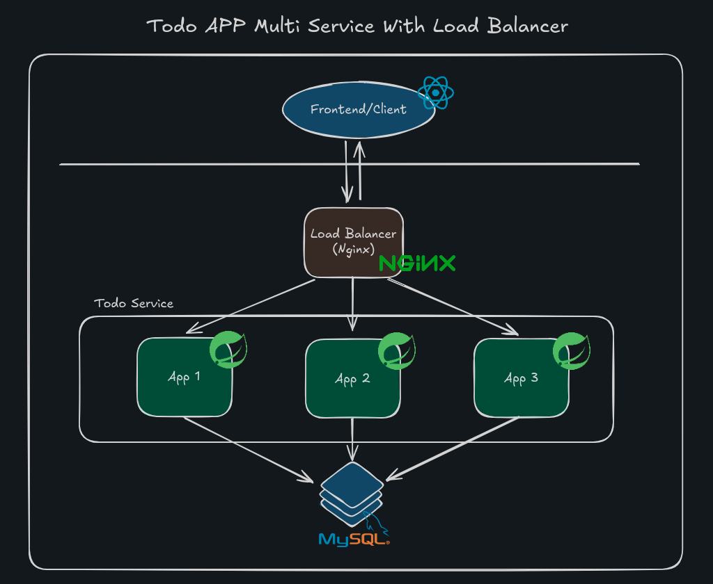

# Todo APP With Load Balancer

```text
Simple todo app with load balancer for high availability backend server. Multi
backend server using docker as server for visualize. In Production or realtime application
one service use real server. In this case we use docker container.

You can see detail architecture image below
```



### By : Jeremi Herodian Abednigo
#### Case : High Availability Backend Service